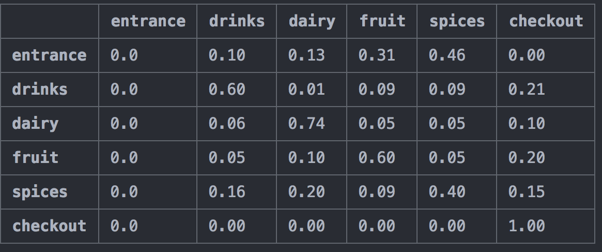
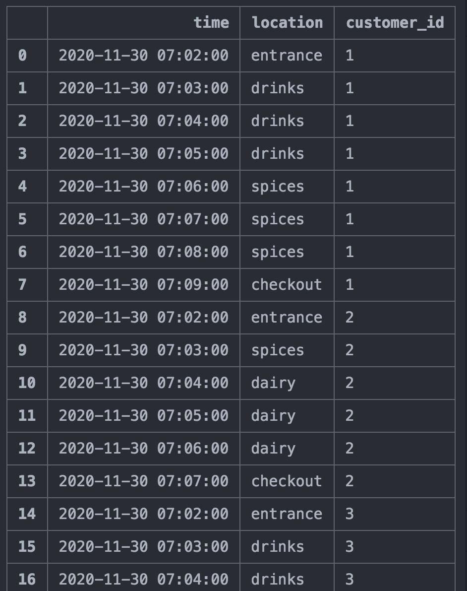
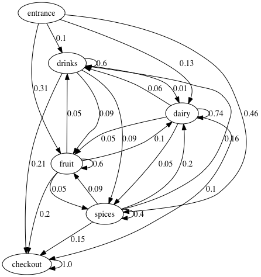

# Markov-chain-simulation
---
>
>
## Introduction


This project aims at simulating customers behaviour in a supermarket. Customers are generated
from a Markov chain modelling with transition probabilities.
Transition probabilities are simply the probabilities of staying in the same state or moving to
a different state given the current state. The probability transition matrix used is available
at `data/Q_matrix.csv` and has been estimated from one week data (dataset not available in this
repository). The possible states considered in the supermarket are:
`['entrance', 'drinks', 'dairy', 'fruit', 'spices', 'checkout']` and will be defined per minute.
The code can easily be adapted to generate the Markov chain for different transition/states/probabilities.



## One day simulation

In this section, let's simulate one full day of customers with their states per minute.

For this, simply run `python simulation_onde_day.py`.

This will simulate customers behaviour minute per minute and save it at `demo/one_day_simulation.csv` . To obtain a realistic arrival time every minute, the program is using an hour count distribution available at `data/customer_per_hour.csv` . Then, the arrival are randomly distributed for all the minutes within each hour.

The program uses a class `Customer` defined in `customer_tools.py`. This class simulates a Markov chain for one customer based on Markov states and the transition probability matrix defined above.

The function `arrival_time_from_hour_distribution` in `simulation_tools.py`, enables to generate
a randomly sampled arrival time per minute to simulate arrival time of customers
in the shop for one day, respecting the count per hour distribution.


The function `simulate_customers` in `simulation_tools.py` enables to generates a Markov chain for each new customer arrival time and return a dataframe with minute per minute states of all customers for one day in the supermarket.
An example generated can be seen at `demo/one_day_simulation.csv`.

To understand better the dataset simulated, an EDA (exploratory data analysis) is performed in the jupyter notebook
`EDA_one_day_simulation.ipynb` as a demo. We can see for example, the number of new entrance per hour,
the repartition of customers for each section, the time spent in the supermarket, the total revenue per hour and the most profitable sections.



## Make Markov diagram

A diagram of the Markov chain can be drawn with `python make_markov_diagram.py`

It uses the probability transition matrix and the possible states.



## Make a gif simulating 100 customers

Run `python make_gif_simulation.py`

It will create a gif of all states of simulated customers in the order of occurrences (no overlap
between customers in the display).

It simulate the behaviour of 100 customers per default but can easily change to any number.

In a first step the function `save_each_state` from `make_gif_tools.py` simulates Nb_customers,
assign a random color for each of them and save all states (per minute) in the supermarket
as png pictures. In a second step, the function `make_gif_from_states` from `make_gif_tools.py`
reads all customers states in the order of occurrences and make a gif of all states (and delete
the png pictures from disk).

## How to use?

```
Clone this repository
Make sure you have installed the packages in requirements.txt
```

## License

[](http://badges.mit-license.org)

- **[MIT license](http://opensource.org/licenses/mit-license.php)**
